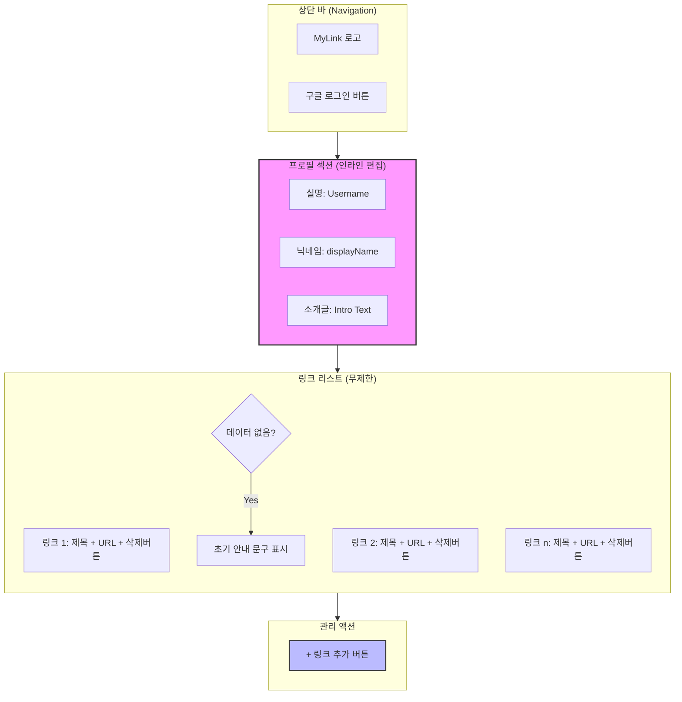

# 마이링크 (MyLink) - 와이어프레임 (Wireframe) v1.0

본 문서는 `PRD v1.5`와 `사용자 시나리오 v1.1`을 바탕으로 설계된 서비스의 시각적 구조와 인터랙션을 정의합니다.

---

## 1. ASCII 아트 와이어프레임 (Mobile-First View)

서비스의 핵심인 '단순함'과 '중앙 집중형' 레이아웃을 표현합니다.

```text
+------------------------------------------+
|  [MyLink]                         (Login) | <--- 헤더 (로고 및 로그인)
+------------------------------------------+
|                                          |
|       [ Username / 실명 ] (Click to edit) | <--- 프로필 영역
|      @[ displayName ]    (Click to edit) |
|                                          |
|   "본인을 소개하는 한 줄 문구입니다."      |
|           (Click to edit)                |
|                                          |
+------------------------------------------+
|                                          |
|  +------------------------------------+  |
|  |  [ 유튜브 채널 바로가기 ]          |  | <--- 링크 블록
|  |  (https://youtube.com/...)  [🗑️]   |  |
|  +------------------------------------+  |
|                                          |
|  +------------------------------------+  |
|  |  [ 개인 블로그 ]                   |  |
|  |  (https://blog.naver.com/...) [🗑️]   |  |
|  +------------------------------------+  |
|                                          |
|        [ + 새 링크 추가하기 ]             | <--- 소유자 전용 버튼
|                                          |
+------------------------------------------+
|       Powered by MyLink © 2026           |
+------------------------------------------+
```

---

## 2. UI 구조도 (Mermaid Diagram)

전체적인 컴포넌트 구성과 흐름을 시각화합니다.



---

## 3. 기능 및 UI 상세 명세 (Wireframe Specs)

### 3-1. 헤더 영역 (Header)
- **Logo**: 서비스 홈으로 이동하는 텍스트 기반 로고.
- **Login/Logout**: 구글 OAuth를 이용한 세션 관리. 로그인 후에는 소유자의 프로필 정보가 활성화됩니다.

### 3-2. 프로필 영역 (Profile Section)
- **특징**: 소유자 접속 시 모든 텍스트는 클릭 시 `<input>` 혹은 `<textarea>`로 변하는 **인라인 편집** 모드가 활성화됩니다.
- **필드**:
    - `Username`: 실명 (예: 홍길동)
    - `displayName`: URL 핸들로 사용될 고유 닉네임 (예: gildong_hong)
    - `Intro`: 최대 100자 내외의 짧은 소개글.

### 3-3. 링크 리스트 영역 (Link List)
- **링크 블록 구성**:
    - **제목**: 방문자에게 보여질 버튼 텍스트 (직접 클릭 수정).
    - **URL**: 실제 연결될 목적지 주소 (직접 클릭 수정).
    - **삭제 버튼 (🗑️)**: 우측에 배치하며, 클릭 시 브라우저 기본 `confirm` 창을 통해 최종 삭제를 확인합니다.
- **정렬 방식**: 새로운 링크 추가 시 리스트의 **최상단**에 즉시 생성되어 편집 편의성을 높입니다.

### 3-4. 하단 액션 (Footer/Actions)
- **[+ 새 링크 추가하기]**: 소유자에게만 노출되는 버튼입니다. 클릭 즉시 빈 링크 블록이 상단에 추가되며, 제목 입력창으로 포커스가 자동 이동합니다.

---

## 4. 구현 테스크 (Implementation Tasks)

1. [ ] **프로젝트 환경 설정**: `my-profile` 디렉토리 내에 React/Next.js 기반의 환경 구성.
2. [ ] **UI 레이아웃 구현**: Flexbox/Grid를 활용하여 모바일 우선의 카드 레이아웃 제작.
3. [ ] **인라인 편집 컴포넌트 개발**: 텍스트 클릭 시 입력 모드로 전환되고, `Enter` 또는 `Blur` 시 데이터가 저장되는 범용 컴포넌트 제작.
4. [ ] **데이터 연동 및 로직**: Firebase 또는 상태 관리 라이브러리를 통해 링크 추가/삭제/수정 로직 구현.
5. [ ] **URL 유효성 검사**: 입력된 URL에 프로토콜이 없을 경우 자동으로 `https://`를 추가해주는 유틸 함수 구현.
